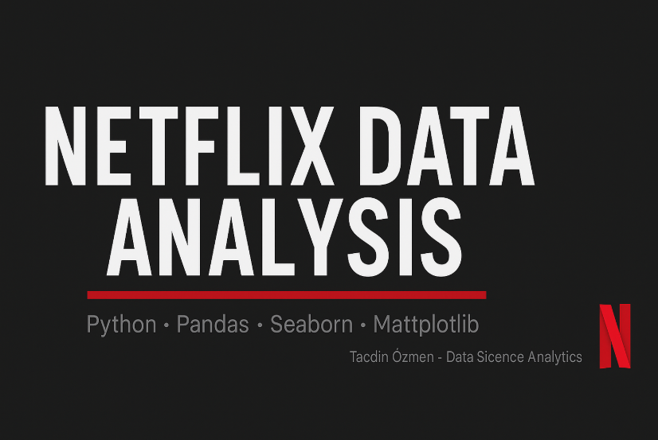

  

# 🎬 Netflix Data Analysis

## 📌 Project Overview
This project aims to analyze the Netflix Movies & TV Shows dataset to uncover meaningful insights such as:
- Distribution of Movies vs TV Shows
- Trends in content production by year
- Most popular countries and genres
- Audience rating distribution
- Key content patterns and creator trends

The project follows a **modular and pythonic structure**, designed for clarity and scalability.

---

## 🧱 Project Structure

<pre>
netflix-data-analysis/
│
├── data/
│ └── netflix_titles.csv # Raw dataset
│ └── netflix_titles_cleaned.csv # Cleaned dataset
│
├── src/
│ ├── eda.py # Exploratory data analysis functions
│ ├── insights.py # Deeper trend and insights analysis
│ └── init.py # For module import
│
├── main.py # Data cleaning & preprocessing pipeline
├── report.py # Consolidated storytelling dashboard
├── .gitignore
└── README.md
<pre>

---

## 🧩 Key Features

- **Data Cleaning & Preprocessing**
  - Handles missing values (`fillna`, `dropna`)
  - Converts `date_added` to `datetime`
  - Standardizes text columns
  - Extracts `duration_minutes` and `seasons`

- **Exploratory Data Analysis (EDA)**
  - Content type distribution
  - Yearly trends (2010–2021)
  - Top 10 producing countries and genres
  - Rating (audience age) distribution

- **Deep Insights**
  - Type-based yearly growth comparison
  - Country-type heatmap
  - Genre diversity over years
  - Top 10 prolific directors

- **Storytelling Report**
  - Run `python report.py` for an interactive visual report.
  - Automatically prints summary statistics and generates visuals.

---

## 🧠 Technologies Used

<pre>
| Category | Library / Tool |
|-----------|----------------|
| Data Manipulation | pandas, numpy |
| Visualization | matplotlib, seaborn |
| Project Management | VS Code, GitHub |
| Version Control | git |
| Environment | Python 3.11+ |
<pre>

---

## 📈 Sample Outputs

<pre>
| Visualization | Description |
|----------------|-------------|
|  | Ratio of Movies vs TV Shows |
|  | Top 10 Countries by Content Type |
|  | Number of Unique Genres per Year |

*(Optional: add screenshots from your generated figures)*
<pre>

---

## ⚙️ How to Run Locally

<pre>
# Clone repository
git clone https://github.com/tcdn7/7-Netflix-data-analysis.git
cd netflix-data-analysis

# (Optional) Create virtual environment
python -m venv venv
source venv/bin/activate  # or venv\Scripts\activate on Windows

# Install dependencies
pip install -r requirements.txt

# Run cleaning and analysis
python main.py
python report.py
<pre>

---

📊 Dataset Source

Kaggle – https://www.kaggle.com/datasets/shivamb/netflix-shows

👤 Author

Tacdin Özmen
Data Science | Python | Analytics Enthusiast